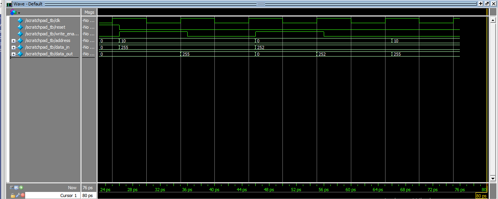

# Scratchpad RAM

A 16x8 synchronous scratchpad RAM — 16 addressable locations, each storing 8 bits (1 byte). Designed for temporary storage during computation, similar to how a processor holds intermediate values close at hand before writing to main memory.

## Architecture Highlights
- **Synchronous Write, Asynchronous Reset:** Data is written on the rising clock edge (`always_ff @(posedge clk)`), ensuring predictable timing. Reset is asynchronous — meaning it responds instantly without waiting for a clock edge, so memory can be cleared even if the clock fails.
- **Single-Port Memory Array:** Implemented as an internal `logic [7:0] mem [0:15]` array — 16 locations, each 8 bits wide. Being internal means it cannot be driven or modified from outside the module, protecting memory integrity.
- **Combinational Read:** `data_out` is driven by a continuous `assign` statement, so reads are instant — no clock cycle needed to retrieve data.

## Ports
| Signal | Direction | Width | Description |
|---|---|---|---|
| clk | input | 1-bit | Clock |
| reset | input | 1-bit | Async reset — clears all 16 locations to 0 |
| write_enable | input | 1-bit | High = write, Low = read |
| address | input | 4-bit | Selects which of the 16 locations to access |
| data_in | input | 8-bit | Data to write into memory |
| data_out | output | 8-bit | Data read from selected address |

## Verification
The self-checking testbench writes known values to two different addresses (`0xA` and `0x0`), reads them back, and uses `$display` statements to confirm correct storage. The final read deliberately checks that writing to one address did not corrupt data at another — verifying memory persistence and isolation across locations.

**Race Condition Prevention:**
Stimulus changes are applied after a `#1` delay following each clock edge (`@(posedge clk); #1;`), accurately modelling physical hold time requirements and preventing zero-delay race conditions between the testbench driving inputs and the RAM sampling them.

## Simulation Output
